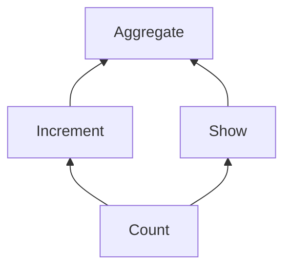

# Compose a Wasm DAG

A simple Directed Acyclic Graph (DAG) component composition which shares a common `count` state.

There should only be one instance of the `count` state, and it should be shared between the `Increment` and `Show` components:



## Compose

Build and compose the components:

```bash
cargo component build --workspace
wasm-tools compose --config config.yml --output aggregate.wasm target/wasm32-wasi/debug/aggregate.wasm
```

## Test

The test is in the [`aggregate`](./crates/aggregate/tests/mod.rs) crate.

Run the test:

```bash
cargo test -p aggregate
```
